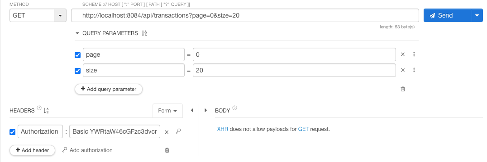

# cc-transaction-system
## Description
This project simulates a real-time credit card transaction processing system using Spring Boot and Apache Kafka. It includes features for transaction production, consumption, authorization, and monitoring.

<pre>
cc-transaction-system/
│
├── transaction-producer/
│   ├── src/
│   ├── target/
│   ├── Dockerfile
│   └── ...
│
├── transaction-consumer/
│   ├── src/
│   ├── target/
│   ├── Dockerfile
│   └── ...
│
├── docker/
│   └── init.sql
│
├── docker-compose.yml
└── ...
</pre>

## Prerequisites
- Docker
- Docker Compose
- JDK 11
- Maven

## Setup

### Step 1: Build the Applications
1. Navigate to the transaction-producer directory and build the jar:
   ```sh
   cd transaction-producer
   mvn clean package
   
2. Navigate to the transaction-consumer directory and build the jar:
   ```sh
   cd transaction-producer
   mvn clean package

### Step 2: Build the Applications
1. Navigate to the root directory and start the services using Docker Compose:
   ```sh
   docker-compose up --build


### Step 3: Monitor the Logs
1. We can monitor the logs to see the transaction processing:
   ```sh
   docker-compose logs -f transaction-producer
   docker-compose logs -f transaction-consumer


## Testing Dead Letter Queue (DLQ)
1. Introduced a failure in the consumer processing logic (thrown an exception for transaction amount more than 800).
2. Failed transactions are moved to the DLQ (topic: transactions-dlq), we can see the transactions by starting the kafka consumer
   ```sh
   kafka-console-consumer --topic transactions-dlq --from-beginning --bootstrap-server localhost:9092
   
## Metrics
- Metrics are exposed via Spring Boot Actuator endpoints. We can access them at:
   ```sh
   http://localhost:8082/actuator/metrics
  
## Verify Authorization
- By accessing consumer API from any webclient (I'm using Talend API Tester) we can verify authorization (When we are trying to access without Authorization header, will get 401 "Unauthorized")
   ```sh
   GET: http://localhost:8082/api/transactions


- We can provide Authorization Header by providing credentials (Username: admin , Password: password)


- Now, when we are hitting the same API will get response like below (Pagination also added)



